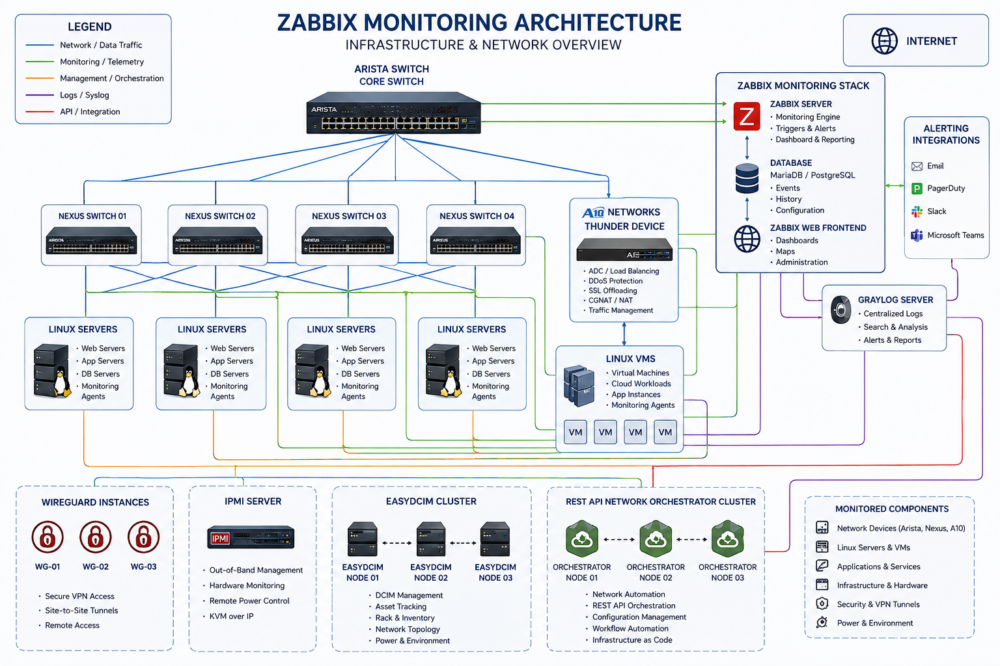

<h1 align="center">Security Engineering Playbooks</h1>

Production-grade security engineering playbooks, operational procedures, hardening standards, monitoring baselines, infrastructure visibility practices, and incident response documentation.

---

# 🎯 Purpose

This repository was created to document practical and operational security engineering procedures commonly used across enterprise infrastructure, cloud platforms, and MSP environments.

The focus is on:
- Infrastructure Security
- Operational Security Procedures
- Incident Response
- Monitoring & Observability
- Linux Hardening
- Cloud Security Baselines
- Compliance-Oriented Operational Controls
- Security Documentation Standards
- Infrastructure Visibility & Automation

---

# 📚 Repository Structure

| Section | Description |
|---|---|
| `incident-response/` | Security incident response procedures and operational workflows |
| `linux-hardening/` | Linux security baselines and server hardening standards |
| `monitoring-observability/` | Monitoring architecture, alerting, and infrastructure visibility |
| `compliance/` | Governance, vulnerability management, and compliance procedures |
| `cloud-security/` | Cloud security baselines and operational controls |
| `network-security/` | Network segmentation and infrastructure protection |
| `scripts/` | Operational automation scripts and infrastructure tooling |
| `diagrams/` | Architecture diagrams and infrastructure visualizations |

---

# 🛡️ Areas Covered

## Incident Response
- Phishing response procedures
- Ransomware containment
- Suspicious login investigations
- Server compromise handling
- DDoS response workflows

## Linux Hardening
- Ubuntu hardening
- AlmaLinux hardening
- SSH security baselines
- Fail2ban configurations
- Audit procedures

## Monitoring & Observability
- Zabbix deployment standards
- Graylog logging architecture
- Alerting baselines
- Log retention strategies
- Infrastructure monitoring standards

## Compliance & Governance
- ISO 27001 operational alignment
- SOC 2 operational controls
- HIPAA security considerations
- Vulnerability management procedures

## Network Security
- Firewall standards
- VLAN segmentation concepts
- VPN security
- CGNAT logging considerations
- Infrastructure segmentation

## Cloud Security
- AWS security baselines
- MFA enforcement
- IAM operational standards
- Cloudflare Zero Trust examples

---

# 🏗️ Infrastructure & Monitoring Architecture

This repository includes generalized infrastructure and monitoring architecture examples covering:

- Arista Core Infrastructure
- Cisco Nexus Aggregation Layer
- A10 Networks Traffic Management
- Linux Servers & Virtual Machines
- Graylog Centralized Logging
- EasyDCIM Infrastructure Management
- WireGuard Connectivity
- REST API Network Orchestration
- Zabbix Monitoring Stack

## Monitoring Architecture Diagram

---

# ⚙️ Technologies & Platforms

## Infrastructure
- Ubuntu
- AlmaLinux
- CentOS
- Docker
- KVM
- ZFS

## Monitoring & Observability
- Zabbix
- Graylog
- SNMP
- PagerDuty

## Networking
- Arista
- Cisco Nexus
- A10 Networks
- WireGuard
- VLANs / VRFs / ACLs

## Cloud & Security
- AWS
- Cloudflare
- MFA
- SIEM
- Vulnerability Management

## Automation
- Bash
- Python
- REST APIs
- Infrastructure Automation

---

# 📌 Operational Focus Areas

This repository emphasizes:
- Enterprise operational maturity
- Infrastructure reliability
- Monitoring visibility
- Security engineering practices
- Incident response readiness
- Compliance-oriented operations
- Automation workflows
- Infrastructure scalability

---

# 📌 Disclaimer

This repository contains:
- Public-safe examples
- Generalized operational procedures
- Sanitized configurations
- Educational documentation
- Non-production architecture examples

No confidential infrastructure details, credentials, or proprietary customer information are included.

---

# 👨‍💻 Author

## Bladimir Fernández López

Senior Engineer | Infrastructure • Networking • Security • Cloud • Automation

- LinkedIn: https://linkedin.com/in/bladimir-fernandez-lopez/
- GitHub: https://github.com/BladimirF7
